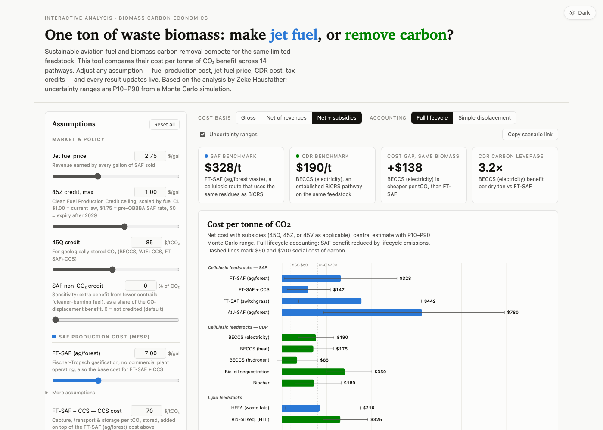

# SAF vs CDR Explorer

**Live tool: https://hausfath.github.io/saf-vs-cdr-explorer/**

Given a ton of waste biomass, is it a better climate investment to make sustainable aviation
fuel (SAF) or to remove carbon (CDR)? This interactive tool compares the cost per tonne of
CO₂ benefit across 14 pathways — five SAF production routes (Fischer-Tropsch, FT+CCS, HEFA,
alcohol-to-jet) and nine biomass carbon removal routes (BECCS variants, waste-to-energy+CCS,
bio-oil sequestration, biochar, biomass injection, biomass burial) — with every major
assumption adjustable.

## What you can adjust

- **SAF production cost (MFSP)** for each pathway — the primary driver
- **Jet fuel price** (SAF's displacement revenue)
- **CDR total cost** for each pathway, calibrated by default to actual offtake pricing
- **Tax credits**: 45Q amount, 45Z Clean Fuel Production Credit ceiling (post-OBBBA $1.00/gal,
  pre-OBBBA $1.75/gal, or $0 for post-2029 expiry), the BECCS-hydrogen 45Q-vs-45V election
  (§45V(d)(2)), and the FT-SAF+CCS 45Q-vs-45Z election (no 45Z at a facility claiming 45Q,
  §45Z(d)(4))
- **Non-CO₂ sensitivity**: optionally credit SAF for reduced contrail warming, as a share of its
  CO₂ benefit
- **Per-pathway details**: mass yield, lifecycle GHG reduction, capture efficiency,
  co-product revenue
- **Accounting basis**: full lifecycle (default; CORSIA lifecycle reductions against the
  89 gCO₂e/MJ well-to-wake fossil jet baseline, 95% net-negativity and co-product displacement
  credit for CDR) vs simple displacement

Results update live: benchmark tiles (FT-SAF vs BECCS-electricity, the most common pathways
today), a $/tCO₂ comparison chart with P10–P90 uncertainty ranges, a carbon-fate-per-dry-ton
chart, and a full data table. **Copy scenario link** encodes all assumptions in the URL so a
specific scenario can be shared.

## How it works

The page is fully self-contained (no dependencies, no build step). The model runs a
4,000-draw Monte Carlo per pathway with split-normal inputs matched to each P10/P50/P90;
sliders set the central (P50) estimate and each input's P10–P90 range scales proportionally.
The 45Z credit is computed per draw from the sampled carbon intensity, `(50 − CI)/50`, as
under current law.

**September 2026 update:** SAF assumptions recalibrated (jet price, CORSIA lifecycle values,
HEFA cost, CCS cost for high-purity CO₂) and several bugs fixed, including uncertainty ranges
that were too narrow and a 45Z + 45Q stack that the statute does not allow. See the
changelog at the end of [METHODOLOGY.md](METHODOLOGY.md).

See [METHODOLOGY.md](METHODOLOGY.md) for the full set of assumptions, formulas, pathway
definitions, and literature sources.

## Running locally

Open `index.html` in any browser. That's it.

## Caveats

- SAF benefits are *avoided* emissions (counterfactual); CDR benefits are *removals*.
  These are not interchangeable if aviation can decarbonize another way.
- Non-CO₂ aviation effects (contrails) are off by default. For 100% SAF, the literature
  implies roughly +16–28% (GWP100) to +46–78% (GWP*) on top of SAF's CO₂ benefit; use the
  slider to test this.
- No commercial FT-SAF+CCS plant exists; those costs are techno-economic estimates.
- HEFA uses waste fats/oils, which mostly don't compete with cellulosic CDR for feedstock and
  are supply-limited (~25 Mt/yr of used cooking oil and animal fats collected globally).
- CDR costs are calibrated to offtake pricing and are not changed by the September 2026 update.

## Credits

Analysis and tool by [Zeke Hausfather](https://github.com/hausfath). Assumptions current as
of September 2026 (post-OBBBA tax credit treatment).

## License

Code: MIT (see [LICENSE](LICENSE)). Jet fuel price data from EIA/FRED (public domain); lifecycle defaults from ICAO CORSIA documents.
